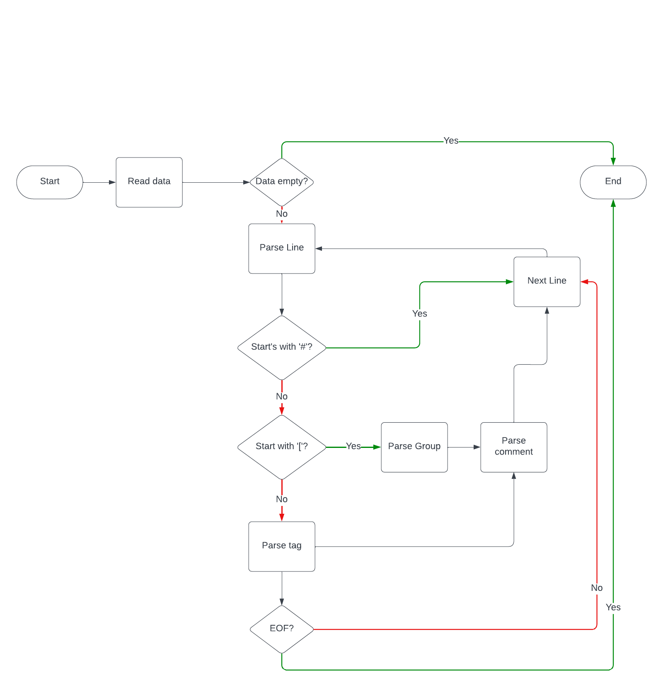

# Tag Parser

Tag Parser is a simple, direct, and to-the-point tag parsing library that aims to provide a simple and easy-to-use
interface for parsing tags from strings. It is written in Rust and is designed to be fast and efficient.

# Structure

An ideal tag file will contain a group and tags that are separated by a delimiter.

Example:

```
[Group]
Tag1 Tag2 Tag3
new_tag
Testing_tag -negated_tag
```

# Parsing Algorithm

The parser is fairly simple, and maintains an easy-to-understand approach. The algorithm for parsing the data is shown
in this flowchart:



# Usage

When a tag file is parsed by the parser, the structure will be a group with a vector of tags. The delimiter can be set
to any character, but the default is newline.

Example of the resulting structure:

```
Group {
    name: "Group",
    tags: [
        "Tag1 Tag2 Tag3",
        "new_tag",
        "Testing_tag -negated_tag"
    ]
}
```

From this, the tags can be further parsed to get the individual tags and negated tags. However, this is not done by the
parser itself and must be done by the user.
